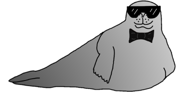

<h1>Agent Seal</h1>

**AgentSeal** is an agent-based model simulating movement of adult harbour seals (Phoca vitulina) outside their breeding and moutling season. Developed by [Magda Chudzinska](https://github.com/MagdaChu).
- Contact Magda Chudzinska (chudzinskam@gmail.com) for more information

[AgentSeal-Grey](https://github.com/KaraWatts/AgentSeal-Grey/tree/master/AgentSeal-Grey)  is an updated version of AgentSeal which allows you to simulate adult harbour seals and adult grey seals simultaneously over a grey seal habitat map. Developed by [Kara Watts](https://github.com/KaraWatts).
- Contact Kara Watts (kdwwatts@gmail.com) for more information
